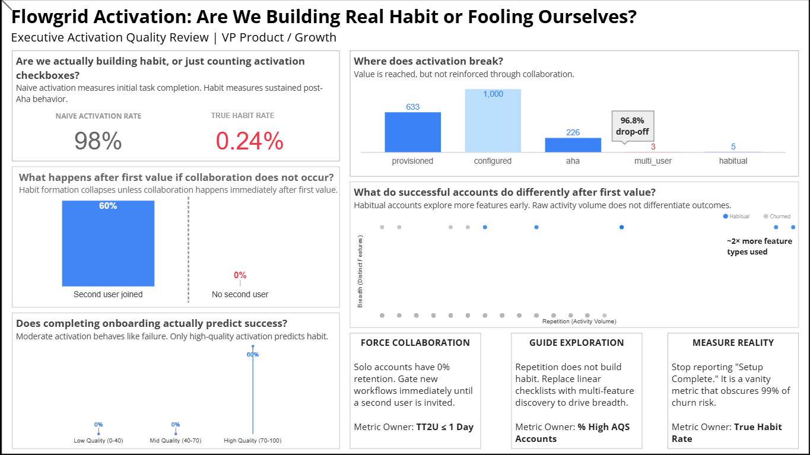
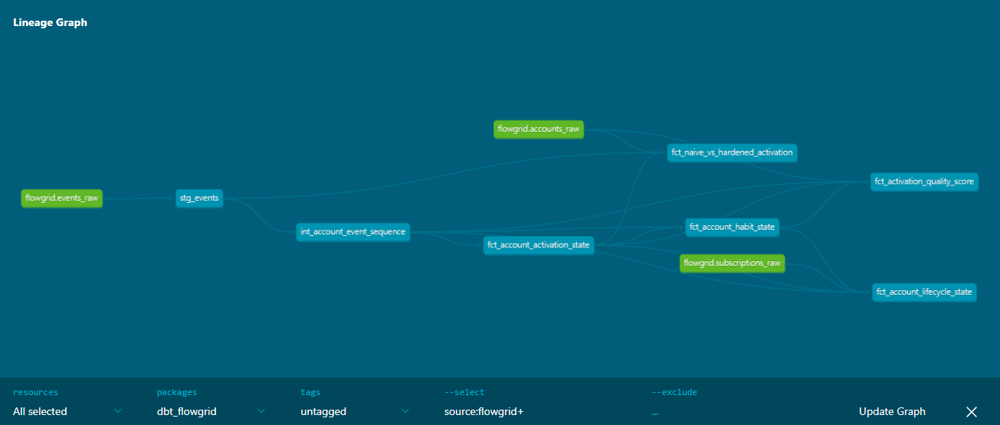

  

<h1 align="center">Flowgrid Activation: Are We Building Real Habit or Fooling Ourselves?</h1>

  <strong>Executive Activation Quality Review</strong> 
  Product Analytics • Activation Metrics • B2B SaaS

  

---

## 🧭 Decision Summary

**Decision:** Redefine activation around collaborative habit, not binary setup completion.

**Why:** 98% of accounts “activated,” but only 0.24% formed sustained, collaborative usage.

**Core Finding:** Activation succeeds at first value but collapses immediately without rapid collaboration.

**Product Risk:** Current metrics report success while silently accumulating churn risk.

**Primary Action:** Gate workflows and onboarding around Time-to-Second-User ≤ 1 day.

**Owner:** Product Analytics

---

## ⚡ Executive Snapshot

When I first looked at Flowgrid’s activation metrics, they appeared strong: ~98% of accounts triggered an activation event.  
But when I reframed activation as **sustained, collaborative usage**, the true habit rate collapsed to **0.24%**.

I found that Flowgrid reliably delivers first value.  
What it fails to do is **reinforce that value through collaboration and breadth of usage**.

As a result, the product reports success while quietly accumulating churn risk.

The gap is not incremental.  
It is structural.

---

## 🧭 How to Read This (2 minutes)

- If you’re short on time, read the **Executive Snapshot** and scan the **Executive Dashboard**.
- If you want the diagnosis, focus on **Where Activation Breaks** and **What Predicts Real Success**.
- If you care about decision rigor, read **Metric Lineage & Hardening** and **Insights → Product Decisions**.

I wrote this document to be skimmed first and read deeply second.

---

## 📊 Executive Dashboard (Decision View)

I designed this dashboard to answer one question only:

**Are we building real habit, or reporting activity as success?**

It contains no filters or exploratory views by design.  
Every visual exists to support a specific product decision.

---

## 🏢 Product & Business Context

Flowgrid is a collaboration-first B2B SaaS product.

This analysis evaluates whether Flowgrid’s activation metrics measure **real habit formation** or merely **early activity**. By redefining activation around sustained, multi-user behavior, I found that reported activation success overstated true product adoption by over 400×.

The goal of this project is not reporting accuracy, but decision safety.

---

## 🧠 Project Framing: Why I Challenged Activation Metrics

This is not a churn post-mortem.

I approached this as a **pre-churn diagnosis**, with one goal:  
to determine whether Flowgrid’s activation metrics were decision-safe.

Instead of asking *“How many users activated?”*, I deliberately asked harder questions:

- Does activation actually predict habit?
- Where does activation collapse?
- Which behaviors separate retained accounts from churned ones?

What follows is a **metric and decision redesign**, not a reporting exercise.

---

<strong>🧠 Metric Philosophy & Why Naive Activation Failed (Details)</strong>

  
## ⭐ Metric Philosophy: How I Defined Success

Binary activation metrics optimize for **motion**, not **outcomes**.  
I rejected them early.

In this analysis, I explicitly separated:

- **Setup** – technical readiness  
- **Aha** – validated first value  
- **Habit** – repeat, collaborative value over time  

I treated activation as **necessary but insufficient**.  
Only habit qualifies as success.

To bridge this gap, I designed an **Activation Quality Score (AQS)** as a leading indicator.  
It combines depth of value, collaboration speed, and habit signals into something that can actually guide decisions.

---

## 🚨 Why Naive Activation Metrics Failed

Using Flowgrid’s naive definition, ~98% of accounts “activated.”

When I redefined activation as sustained, multi-user behavior, the true habit rate dropped to **0.24%**.

That gap exposed a classic **liar’s funnel**.

Binary activation collapses a complex behavioral journey into a checkbox and dramatically overstates success.  
Completion is easy. Habit is rare.

---

## 🔍 Where Activation Actually Breaks

Lifecycle analysis showed me something important:

- All Aha moments occur within Day 0–1  
- Provisioning and configuration are not bottlenecks  

Flowgrid does not struggle to deliver first value.

The failure happens **after** that.

I observed a **96.8% drop-off** between Aha and multi-user usage.

**Aha is necessary, but not sufficient.**  
Without fast reinforcement through collaboration, first value **decays instead of compounding**.

---

## 📈 What I Found Actually Predicts Success

Several signals clearly differentiated habitual accounts from churned ones.

### Collaboration Timing
I found that accounts inviting a second user within one day had a meaningful chance of becoming habitual.  
Once Time-to-Second-User exceeded one day, the habit rate fell to **0%**.

Delay is fatal.

### Activation Quality
Low and mid-quality activation behaved identically, both failed.  
Only high AQS correlated with habit, at ~60%.

Moderate activation is not a stepping stone.  
It is a dead end.

### Behavioral Breadth
Habitual accounts explored roughly **2× more feature types** early on.  
Raw activity volume did not differentiate outcomes.

I validated this statistically. The difference reflects *how* users engage, not how much they click.

---

## 🧱 How I Hardened the Metrics

I did not compute activation metrics directly from raw events.

Instead, I built a layered modeling approach that enforces:

- Event deduplication  
- Strict sequencing  
- Lifecycle validity  

I intentionally isolated naive activation metrics to demonstrate inflation.  
All decision-grade metrics depend exclusively on hardened fact tables.

**Reference Implementation**
- View the naive vs. hardened activation logic: [`analysis/01_liars_funnel`](analysis/01_liars_funnel)
- View the lifecycle and habit modeling layer (dbt): [`dbt/models/facts`](dbt/models/facts)

---

## 🧭 Decisions This Analysis Forces

This analysis leads to three unavoidable product decisions if Flowgrid wants activation to predict retention.

### 1️⃣ Force Early Collaboration

Solo usage does not produce habit.  
Accounts that fail to invite a second user within one day have a **0% habit formation rate**.

**Decision:**  
I would gate new workflows and advanced actions until a second user is invited.

**Metric Owner:** 
Time to Second User ≤ 1 day

---

### 2️⃣ Replace Checklists with Guided Exploration

Repeated usage of a single feature does not build habit.  
Habitual accounts demonstrate **early behavioral breadth**, not higher activity volume.

**Decision:**  
I would replace linear setup checklists with guided, multi-feature onboarding paths that reinforce value across the product surface.

**Metric Owner:**
% of accounts reaching High Activation Quality Score (AQS)

---

### 3️⃣ Stop Treating Activation as a Binary Event

Binary activation reports success while masking the majority of churn risk.  
It optimizes for completion, not retention.

**Decision:**  
I would stop reporting “Setup Complete” as a success metric and elevate habit-based activation to the executive level. 
It hides **99% of churn risk** and creates false confidence.

**Metric Owner:**
True Habit Rate

---

## 🚫 Metrics I Would Stop Reporting

- Binary “Activation Completed”  
- Setup checklist completion rates  
- Single-user activation events  

These metrics create false confidence and mask the 99% of churn risk that occurs after first value.

---

## ⚠️ Limitations & What I Did Not Solve

- The data is synthetic, though behavior-faithful and intentionally noisy  
- I did not model pricing or revenue outcomes  
- Habit is defined behaviorally, not financially  
- I deliberately avoided predictive or ML models  

These constraints are intentional and do not weaken the directional conclusions.

---

## 🛠️ Tech Stack & Implementation

I built this analysis end-to-end using a modern analytics stack, chosen to support **metric rigor and reproducibility**, not speed of visualization.

- **SQL (BigQuery)**  
  Used advanced window functions and event sequencing to construct lifecycle states, sessionized behavior, and collaboration timing logic.

- **Python**  
  Used to generate behavior-faithful synthetic data, inject controlled data inconsistencies, and run statistical validation to support metric hardening. Python supports the analysis; it does not drive the conclusions.

- **dbt (Data Build Tool)**  
  Modeled hardened, decision-safe fact tables with explicit DAGs for lifecycle validation, metric lineage, and testable assumptions.

- **Looker Studio**  
  Designed a constrained, executive-level dashboard using calculated fields and blended sources to enforce narrative order and prevent exploratory misuse.

- **Git**  
  Used for version control and to simulate a production analytics workflow, separating raw data, transformations, and decision outputs.

---

## 🧠 How I Approach Product Analytics Problems

This project reflects my analytical approach & philosophy:

- I redefine success metrics instead of optimizing dashboards  
- I invalidate comforting KPIs rather than defend them  
- I treat activation as a system, not a step  
- I translate evidence directly into product decisions  
- I know when *not* to use ML or over-segmentation  

The value is not in the charts.  
It’s in **what I chose to measure, what I rejected, and what I decided to do next**.

---

## 📣 Call to Action

I am currently exploring Senior Product Analyst and Product Analytics roles where this level of metric rigor can be applied to real user data.

If your team needs to move beyond vanity metrics and into decision-safe product analytics, let’s talk.
